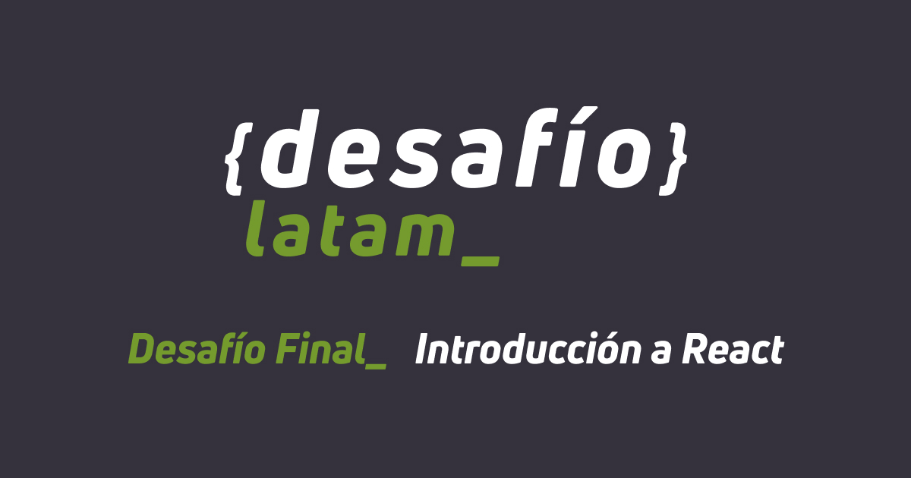

# Solución al Desafío "Base de datos colaboradores"

## Academia Desafío Latam | Bootcamp Fullstack con JavaScript - G41

### Tabla de contenidos

- [Demostración](#demostración)
  - [Vista previa](#vista-previa)
  - [Video de demostración](#video-de-demostración)
- [Guía para obtener un token de acceso](#guía-para-obtener-un-token-de-acceso)
  - [1. Crear una cuenta en TMDb](#1-crear-una-cuenta-en-tmdb)
  - [2. Generar un token de acceso](#2-generar-un-token-de-acceso)
  - [3. Guarda el token en las variable de entorno](#3-guarda-el-token-en-las-variable-de-entorno)

### Demostración

#### Vista previa

#### Video de demostración

[Enlace a YouTube](https://youtu.be/zHc8mezZKdE)

### Guía para obtener un token de acceso

Para ejecutar el proyecto es necesario crear una cuenta en el sitio de TMDb (usando datos de contacto), generar un token de acceso válido para hacer las peticiones a la API y reemplazar su valor en las variables de entorno en un archivo `.env` siguiendo el ejemplo mostrado en `.env.example`.

#### 1. Crear una cuenta en TMDb

- Ingresa a [la página de registro de TMDb](https://www.themoviedb.org/signup) para registrarte.
- Verifica tu cuenta siguiendo los pasos que te llegarán al correo que ingresaste para el registro.

#### 2. Generar un token de acceso

- Ingresa a tu cuenta en la plataforma.
- Solicita un token de acceso haciendo click en el botón "Getting started" [aquí](https://developer.themoviedb.org/reference/intro/getting-started).
- Se te solicitará que ingreses algunos datos de contacto adicionales para generar el token (dirección, teléfono, etc.), pero no se te pedirán datos de pago para acceder a la versión gratuita.
- Te llegará un mensaje al correo registrado con el enlace donde puedes consultar tu token en cualquier momento.

#### 3. Guarda el token en las variable de entorno

- Modifica el valor de `VITE_API_TOKEN` en el archivo `.env.example`, reemplazando "YOUR_TOKEN" por tu token de acceso para la API.
- Renombra el archivo `.env.example` como `.env`

Listo, la aplicación está lista para ejecutarse.
